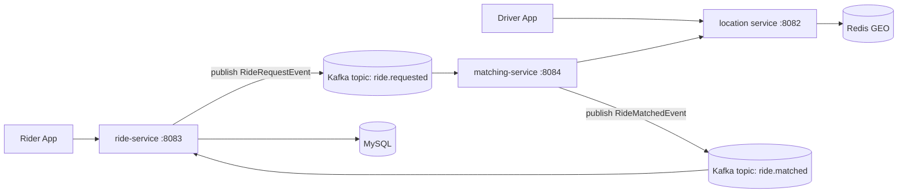

# Uber App (Ride Sharing Microservices)

A Java/Spring-based ride-sharing backend built with a microservice architecture.

This repository contains three services:
- `ride-service` (ride lifecycle + persistence)
- `matching-service` (driver matching + orchestration)
- `location` (real-time driver location using Redis GEO)

The services communicate asynchronously using Apache Kafka.

## Table of Contents
- [Architecture](#architecture)
- [Tech Stack](#tech-stack)
- [Repository Structure](#repository-structure)
- [How the Ride Flow Works](#how-the-ride-flow-works)
- [Prerequisites](#prerequisites)
- [Quick Start](#quick-start)
- [Configuration](#configuration)
- [API Reference](#api-reference)
- [Kafka Topics and Events](#kafka-topics-and-events)
- [Troubleshooting](#troubleshooting)
- [Testing and Build](#testing-and-build)
- [Production Notes](#production-notes)
- [Known Limitations](#known-limitations)

## Architecture



## Tech Stack
- Java 21
- Spring Boot 4.0.5
- Spring Web MVC
- Spring Data JPA + MySQL
- Spring Data Redis (GEO)
- Spring for Apache Kafka
- Spring Cloud OpenFeign (in `matching-service`)
- Maven Wrapper (`mvnw`, `mvnw.cmd`)
- Docker Compose (Redis, MySQL, Zookeeper, Kafka)

## Repository Structure

```text
.
├── docker-compose.yml
├── location/
├── matching-service/
└── ride-service/
```

Service ports:
- `location`: `8082`
- `ride-service`: `8083`
- `matching-service`: `8084`

## How the Ride Flow Works
1. Rider sends a request to `POST /api/v1/rides/request` (ride-service).
2. ride-service stores the ride in MySQL and sets status to `MATCHING`.
3. ride-service publishes `RideRequestEvent` to Kafka topic `ride.requested`.
4. matching-service consumes this event.
5. matching-service calls location service (`/api/v1/locations/drivers/nearby`) to fetch nearby drivers.
6. matching-service selects the best driver and publishes `RideMatchedEvent` to `ride.matched`.
7. ride-service consumes `RideMatchedEvent`, updates `driverId`, and sets status to `ACCEPTED`.
8. Rider can fetch ride details from `GET /api/v1/rides/{rideId}`.

## Prerequisites
- Java 21
- Docker + Docker Compose
- Git
- Free ports: `2181`, `3306`, `6379`, `9092`, `8082`, `8083`, `8084`

## Quick Start

### 1. Start Infrastructure
From repository root:

```bash
docker compose up -d
```

### 2. Start Services (3 terminals)

Terminal A:
```bash
cd location
./mvnw spring-boot:run
```

Terminal B:
```bash
cd matching-service
./mvnw spring-boot:run
```

Terminal C:
```bash
cd ride-service
./mvnw spring-boot:run
```

On Windows PowerShell use `./mvnw.cmd`.

### 3. Seed Driver Locations (required)
Matching only succeeds if Redis has active drivers.

```bash
curl -X POST http://localhost:8082/api/v1/locations/drivers/update \
  -H "Content-Type: application/json" \
  -d '{"driverId":"driver:1","latitude":6.0328,"longitude":80.2167}'

curl -X POST http://localhost:8082/api/v1/locations/drivers/update \
  -H "Content-Type: application/json" \
  -d '{"driverId":"driver:2","latitude":6.0335,"longitude":80.2170}'
```

### 4. Create a Ride

```bash
curl -X POST http://localhost:8083/api/v1/rides/request \
  -H "Content-Type: application/json" \
  -d '{
    "riderId":"rider:2",
    "pickupLatitude":"6.0329",
    "pickupLongitude":"80.2168",
    "pickupAddress":"Galle Fort, Galle, Sri Lanka",
    "dropLatitude":"6.9271",
    "dropLongitude":"79.8612",
    "dropAddress":"Colombo Fort, Colombo, Sri Lanka"
  }'
```

### 5. Fetch Ride by ID

```bash
curl http://localhost:8083/api/v1/rides/{rideId}
```

Expected after match:
- `driverId` is populated
- `status` is `ACCEPTED`

## Configuration

### Infrastructure
Defined in `docker-compose.yml`:
- Redis: `localhost:6379`
- MySQL: `localhost:3306`
- Kafka: `localhost:9092`
- Zookeeper: `localhost:2181`

### Service Config Files
- `location/src/main/resources/application.yaml`
- `ride-service/src/main/resources/application.yaml`
- `matching-service/src/main/resources/application.yaml`

### Important Alignment Rules
- Topic names must match exactly across producers and consumers:
  - `ride.requested`
  - `ride.matched`
- For cross-service JSON event compatibility:
  - Disable Kafka type headers on producer when needed.
  - Use explicit default deserialization type on consumer when needed.

## API Reference

## location service (`:8082`)
- `POST /api/v1/locations/drivers/update`
  - Body:
    ```json
    {
      "driverId": "driver:1",
      "latitude": 6.0328,
      "longitude": 80.2167
    }
    ```
- `GET /api/v1/locations/drivers/nearby?latitude=6.0329&longitude=80.2168&radius=5.0`
- `DELETE /api/v1/locations/drivers/{driverID}`

## ride-service (`:8083`)
- `POST /api/v1/rides/request`
- `GET /api/v1/rides/{rideId}`
- `GET /api/v1/rides/rider/{riderId}/rides`
- `PUT /api/v1/rides/{rideId}/start`
- `PUT /api/v1/rides/{rideId}/complete`
- `PUT /api/v1/rides/{rideId}/cancel`

## matching-service (`:8084`)
No public rider/driver REST endpoints; event-driven consumer/producer service.

## Kafka Topics and Events

### Topic: `ride.requested`
Produced by: `ride-service`  
Consumed by: `matching-service`

Event payload fields:
- `rideId`
- `riderId`
- `pickupLatitude`
- `pickupLongitude`
- `pickupAddress`
- `dropLatitude`
- `dropLongitude`
- `dropAddress`

### Topic: `ride.matched`
Produced by: `matching-service`  
Consumed by: `ride-service`

Event payload fields:
- `rideId`
- `riderId`
- `driverId`
- `driverLatitude`
- `driverLongitude`
- `distanceToPickup`

## Troubleshooting

1. Ride stays in `MATCHING`
- Ensure driver locations are pushed to `location` service first.
- Confirm all 3 services are running.
- Confirm Kafka is running (`docker compose ps`).
- Verify topic names are exactly `ride.requested` and `ride.matched`.

2. `driverId` stays `null`
- Check matching-service logs for `No nearby drivers found`.
- Check ride-service logs for `Received RideMatchedEvent`.

3. Kafka deserialization issues
- Verify consumer JSON config (`trusted.packages`, `use.type.headers`, `default.type`).

4. MySQL connection issues
- Ensure MySQL in compose is up and credentials match service config.

## Testing and Build
Build each service:

```bash
cd location && ./mvnw -DskipTests compile
cd matching-service && ./mvnw -DskipTests compile
cd ride-service && ./mvnw -DskipTests compile
```

Run tests:

```bash
cd location && ./mvnw test
cd matching-service && ./mvnw test
cd ride-service && ./mvnw test
```

## Production Notes
- Move credentials and URLs to environment variables/secrets.
- Add API gateway and service discovery for scale.
- Add idempotency/retry strategy for event processing.
- Add dead-letter topics (DLQ) for failed events.
- Add distributed tracing and centralized logs.
- Add robust validation and error model.

## Known Limitations
- Some DTO/field names contain typos (`pickupAdress`, `dropAdress`, `cancleRide`) preserved for compatibility.
- Matching score uses random simulated ratings.
- No auth/authz yet.
- No API docs endpoint (Swagger/OpenAPI) configured yet.
- DB name in `docker-compose.yml` and `ride-service` config should be reviewed and aligned for clean environments.
